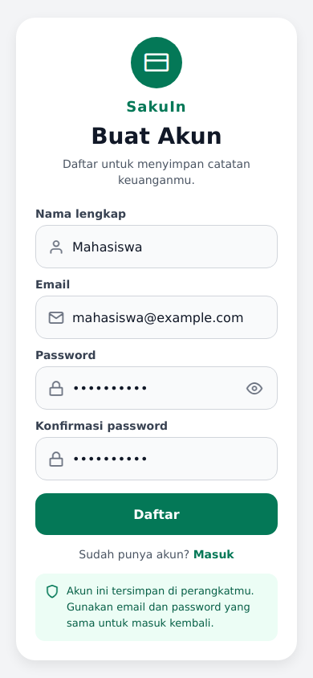
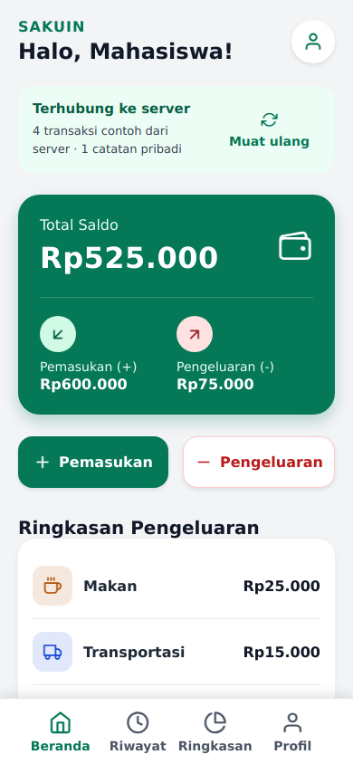
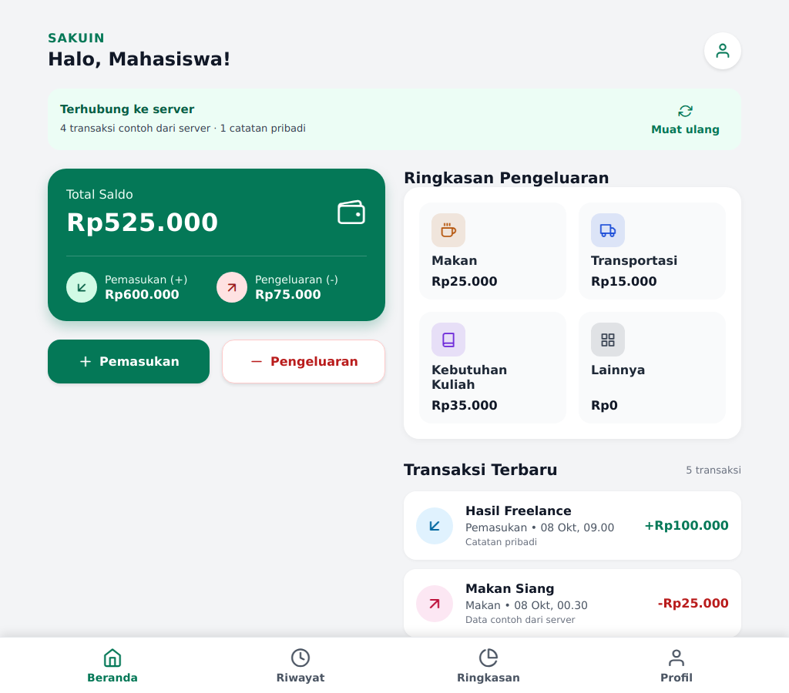

# Hasil pengujian SakuIn

> Laporan berikut mencatat versi sebelum pemisahan external styles. Hasil pemeriksaan versi yang diperbaiki ada di `VERIFIKASI_EXTERNAL_STYLING.md`.

Tanggal: 8 Oktober 2026. Program: hasil Task 01–03 Week 3 dan Week 4.

## Pemeriksaan yang dijalankan

| Pemeriksaan | Hasil aktual |
| --- | --- |
| npm run typecheck | Lulus tanpa error TypeScript |
| npm test | 15 pengujian lulus, 0 gagal |
| Export bundle web | Berhasil |
| Export bundle Android | Berhasil |
| Export bundle iOS | Berhasil |
| Alur UI dengan Chromium/Playwright | 14 pemeriksaan lulus, tidak ada page error |
| Lebar layar browser 320, 390 dan 1024 px | Tidak ada overflow horizontal; nominal pemasukan/pengeluaran terlihat |

## Skenario keamanan Week 3

| Skenario | Hasil aktual |
| --- | --- |
| Login dengan credential benar | Sesi dibuat; masuk Beranda |
| Login dengan password/email salah | Ditolak dengan pesan umum; tanpa sesi |
| Input kosong/email invalid/password pendek | Ditolak dengan pesan validasi |
| Konfirmasi password | Diperiksa pada form Daftar |
| Password tidak terbuka | Input bertipe password secara bawaan; tombol tampil/sembunyi berfungsi |
| Verifier password | Salt dan hash PBKDF2 tersimpan; password asli tidak ditulis |
| Logout | Record sesi dihapus; halaman privat terkunci |
| Baca data kembali | Sesi dan transaksi pulih saat reload; catatan tersedia setelah login ulang |
| Sesi kedaluwarsa/rusak | Ditolak dan dihapus |
| Transaksi terenkripsi | Ciphertext tidak memuat teks asli; pembacaan kembali berhasil |
| Ciphertext berubah | Dekripsi ditolak |
| Migrasi data lama | Catatan pengguna dipertahankan; profil/password plaintext dan sesi lama dihapus |

## Pemeriksaan UI browser

1. Halaman privat diarahkan ke auth saat belum login.
2. Input kosong ditolak pada UI.
3. Daftar berhasil dan kembali ke form login; password tersembunyi.
4. Password salah ditolak dan feedback tampil.
5. Login benar masuk Beranda; empat data API menghasilkan saldo Rp425.000.
6. Perubahan JSON server muncul pada daftar dan saldo sesudah Muat ulang.
7. Catatan pribadi tersimpan, nominal negatif ditolak, saldo ikut berubah.
8. Tidak ada overflow horizontal pada 320, 390, dan 1024 px.
9. Session dan transaksi pulih setelah reload.
10. Gagal koneksi ditangani; tombol Muat ulang memulihkan data.
11. Navigasi Riwayat, Ringkasan, Profil berfungsi; logout kembali ke login.
12. Session terhapus; profil/verifier/transaksi terenkripsi; key non-extractable; localStorage tidak berisi rahasia.
13. Deep link ke halaman privat ditolak setelah logout.
14. Login ulang mempertahankan catatan pribadi.

## Hasil API Week 4

GET ke server yang benar-benar berjalan menghasilkan HTTP 200 dan JSON array. DTO dipetakan ke model UI. Perubahan JSON server tampil setelah Muat ulang tanpa restart server. Daftar, saldo dan ringkasan menggunakan data yang sama.

Pengujian juga menolak payload invalid/ID ganda dan menangani HTTP 503, JSON rusak, timeout, pembatalan, serta koneksi gagal. Data terakhir tetap diberi keterangan jika pembaruan gagal, dan tombol muat ulang memulihkan koneksi.

## Tangkapan layar

Tangkapan layar menggunakan akun dan transaksi fiktif. Beranda menampilkan saldo Rp525.000 setelah satu pemasukan pribadi Rp100.000 ditambahkan ke saldo contoh awal Rp425.000. Catatan hasil pengujian browser tidak menjadi data bawaan dalam ZIP.

## Batas pengujian

Pengujian unit native memakai test double untuk SecureStore/AsyncStorage dan operasi AES-GCM node:crypto. Pengujian browser memakai Web Crypto dan IndexedDB yang berjalan. Ini tidak mengklaim pengujian keystore pada HP fisik.

Bundle Android/iOS berhasil dibuat, tetapi aplikasi belum dijalankan pada HP fisik atau emulator Android/iOS. TalkBack, VoiceOver, pembesaran font perangkat, dan penyimpanan SecureStore pada perangkat perlu diperiksa melalui panduan demo.

| Pemeriksaan perangkat | Status |
| --- | --- |
| Menjalankan hasil pada Expo Go SDK 57 | Belum dijalankan di perangkat fisik |
| Verifikasi SecureStore pada Android/iOS | Perlu pengujian perangkat |
| TalkBack/VoiceOver | Perlu pengujian perangkat |
| Commit/push repository kelas | Dilakukan pengguna pada repository kelas |

## Menjalankan ulang

    npm ci
    npm run typecheck
    npm test
    npx expo export --platform all

Pengujian API otomatis membuat server sendiri; npm run api tidak perlu aktif untuk npm test. Untuk demo UI, server dan aplikasi harus berjalan bersamaan seperti pada README.
